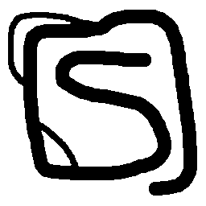
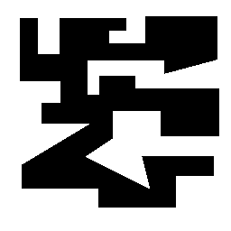
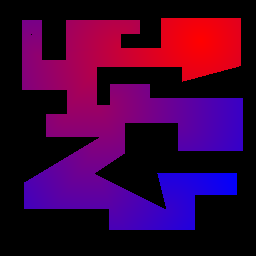
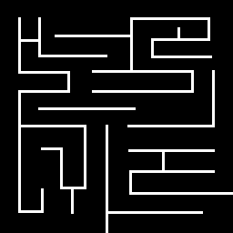
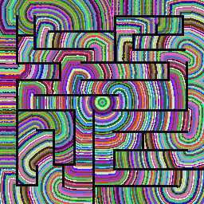
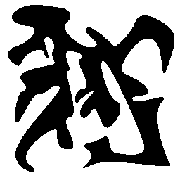
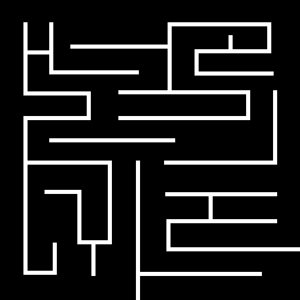
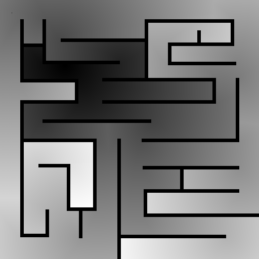
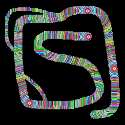

# Geodesic DT with occlusion points propagation 2D and 3D 

- Algorithm: Ruben Cardenes
- Implementation: Ruben Cardenes
- Date: Oct 2002
- Paper: Occlusion Points Propagation Geodesic Distance Transformation, ICIP 2003
  https://www.researchgate.net/publication/221120209_Occlusion_points_propagation_geodesic_distance_transformation

## Description
This code implements a geodesic distance map calculation. It is geodesic in the sense that it is constrained to a domain, so distances between source point and any point are not Euclidean if the domain is not convex. See 2D examples.     

## Installation
Clone the repository. 
Change to the created directory.
Execute "make" 

## 2D version:
This version is purely C code. 

Usage:
```
geodesicDT2D [options] sourcefile.txt domain.png out.png
              -d (debug mode, outputs the oclussion points in png format)
              -c color output (0: gray, 1: red-blue, 2: random, 3: green scale)
```
- source_points: txt file with coordinates of source points 
- input_domain_image: input domain image in png format, positions with zero values are the one where the distance map will be computed, non-zero values are outside the domain  
- ouput_image: output distance map image in png format 

The 2D version uses png for input and output. 

Examples for one point:
```
geodesicDT2d -c 0 example_data/source_2D_02.txt example_data/domain256_1.png output01.png
geodesicDT2d -c 1 example_data/source_2D_03.txt example_data/domain256_2.png output02.png
geodesicDT2d -c 2 example_data/source_2D_01.txt example_data/domain256_3.png output03.png
geodesicDT2d -c 3 example_data/source_2D_01.txt example_data/domain256_4.png output04.png
geodesicDT2d -c 0 example_data/source_2D_01.txt example_data/domain512_3.png output05.png
```

  <br> 
  <br> 
  <br>
  <br>
  <br>

Example for several points (4 points)
```
geodesicDT2d -c 2 example_data/source_2D_4_points.txt example_data/domain256_1.png output06.png
```
  <br>


# Python wrapper 

```py
from geodesicDT2d import run_geodesic2dDT_wrapper

debug = 0
color_mode = 0
run_geodesic2dDT_wrapper('example_data/source_2D_02.txt','example_data/domain256_1.png','output01.png', color_mode, debug)
color_mode = 1
run_geodesic2dDT_wrapper('example_data/source_2D_03.txt','example_data/domain256_2.png','output02.png', color_mode, debug)
```
## 3D version 
This version is implemented in C and C++ 

Usage:
```
geodesicDT3d [options] source_points.txt domain_image.mhf output_image.mhd
```

- source_points: txt file with coordinates of source points
- domain_image: input image in metaheader data format 
- ouput_image: output image in metaheader data format

This 3D version uses input and output format in metaheader format, which is just a text header file and a raw data file as in ITK.org. 

Example With opened domain (11 source points):
```
geodesicDT3d example_data/source_3D_01.txt example_data/domain3d_80_01.mhd out.mhd
```

Example With closed domain (9 source points):
```
geodesicDT3d example_data/source_3D_02.txt example_data/domain3d_80_02.mhd out.mhd
```

## Notes
For both versions the input and output are a list of single points defined in a txt file. The code can be easily modified to accept an arbitrary set of pixels given as an image. 
The domain region of interest are always pixels equal to zero

## License
This code is released under the MIT license. 

If you use this work for academic or commercial use, please cite the paper: 
  Occlusion Points Propagation Geodesic Distance Transformation, ICIP 2003
  https://www.researchgate.net/publication/221120209_Occlusion_points_propagation_geodesic_distance_transformation


